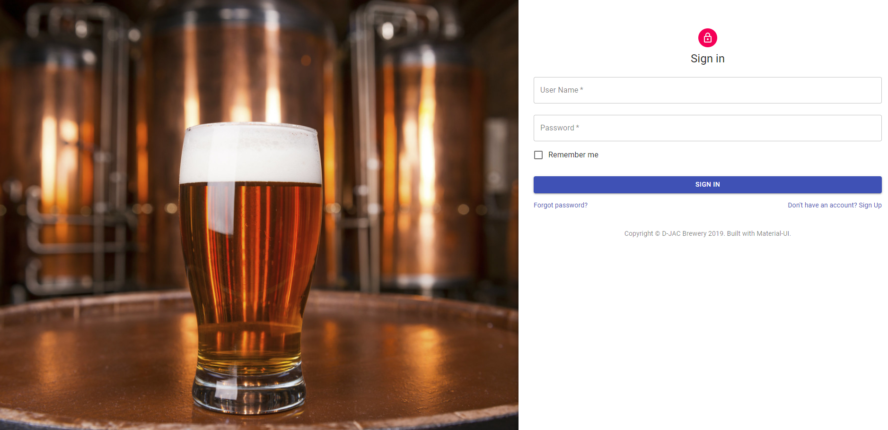
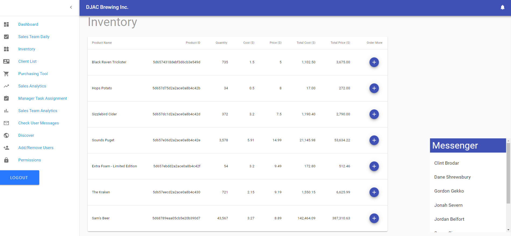
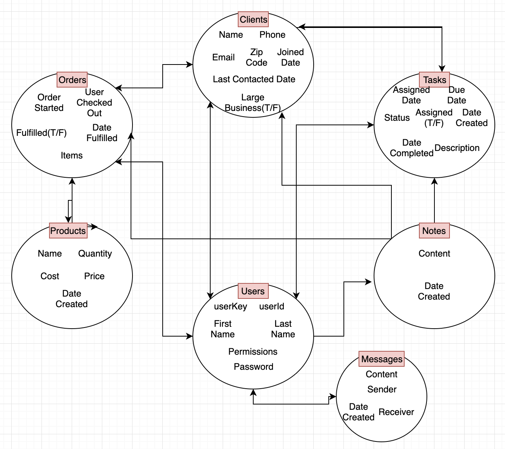

# J-CARD Brewery Solutions
# React-Built MOCK CRM 

## Table of contents

- [General info](#general-info)
- [Technologies](#Technologies)
- [Containers](#Containers)
- [Deployment](#Deployment)
- [Code Overview](#Code-Overview)
- [Summary](#Summary)
- [CSS style](#CSS-style)
- [Routing Explained](#Routing-Explained)

## General info

A mock-CRM(Customer Relations Management Tool) with the focus of a start-up/small brewery company. It will feature a brewery-themed dashboard complete with a login feature and interchangeable dashboard components based upon binary permissions. The componenets will be the minimum set for a business to gleen information from an influx of data (which is stored in mongodb). 

This project utilizes a full MERN stack in order to CRUD data and display it realtime on visualizations. 
- Mongodb
- Express
- React
- Node.js

CRM Link: https://shielded-retreat-69523.herokuapp.com/

## Technologies

Project is created with:

- [React](https://reactjs.org/)
- [React-Router](https://reacttraining.com/react-router/)
- [React-Redux](https://react-redux.js.org/)
- [Passport.js](http://www.passportjs.org/)
- [Material-UI](https://material-ui.com/)
- [JavaScript](https://www.javascript.com/)
- [Bootstrap](https://getbootstrap.com/)
- [Node.js](https://nodejs.org/)
- [Express.js](https://expressjs.com/)
- [MongoDb](https://www.mongodb.com/)
- [Mongoose](https://mongoosejs.com/)
- [Socket.io](https://socket.io/)
- [Bcrypt.js](https://www.npmjs.com/package/bcrypt)
- [React-Chartjs-2](https://github.com/jerairrest/react-chartjs-2)

## Containers

- Dashboard (Home)
- Sales Team Daily
- Inventory
- Inventory Supplies
- Client List
- Purchasing Tool
- Manager Task Assignment
- Analytics 
- Check User Messages
- Discover 
- Add / Remove Users
- Permissions
- Logout
- Messager APP

## Deployment

Download the repository

- Copy the repo
- In your terminal, cd to the CRM folder directory, `$npm i`
- To run on browser: `npm start`
- You can also use the heroku-link for a demo:
- CRM Link: https://shielded-retreat-69523.herokuapp.com/

## Code Overview

- MERN stack

## Summary

- This project is a mock-CRM for a start-up/small brewery company. 

## CSS style

- The main part of CSS for this project was done using mateiral-ui interfaced with React. 

## Routing-Explained

## Authors

- Anthony Lam
- Clint Brodar
- Dane Shrewsbury
- Jonah Severn
- Robert Weston

## License

- Open Source
- Created for the University of Washington Code-Boot Camp 2019: Project #3

